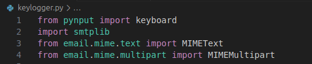
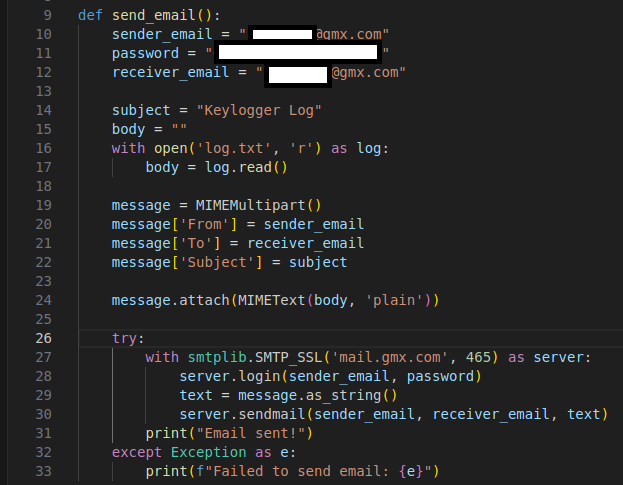
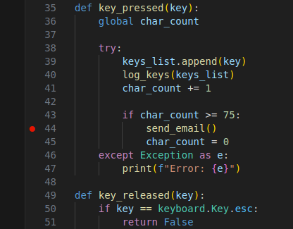
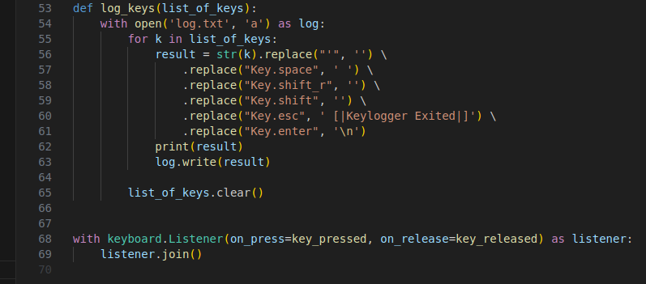
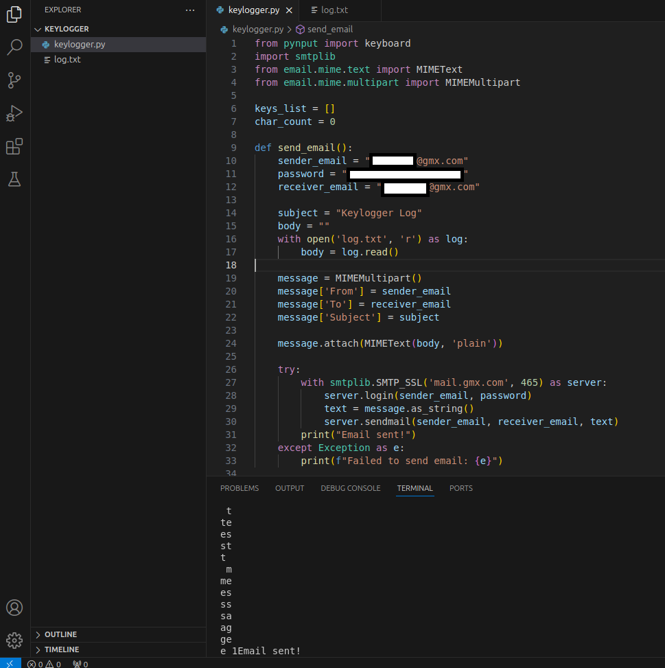
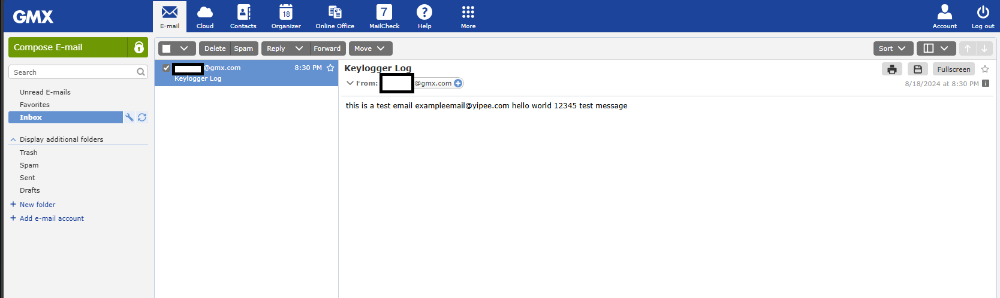
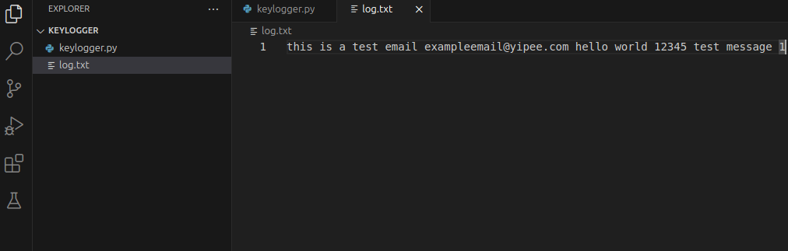

# Keylogger with Email Exfiltration
 
### Project Goal 
Develop a Python-based keylogger capable of capturing keystrokes and sending the log files to a specified email address securely. This project demonstrates expertise in Python programming, secure email transmission, and an understanding of ethical hacking principles.

# Code

### Imports

First I began by importing python libraries that will be needed to make the code possible:
- pynput
    - used to listen for keyboard inputs.
- smtplib
    - used to connect to the mail server (GMX) and send emails with the captured keystrokes.
- email.mime.text
    - used to create the text inside of the email.
- email.mime.multipart
    - used to create the overall email structure.

### SMTP Email Configuration and Data Transmission

This section of the code sets up the email service for sending the logged keystrokes. It configures the sender's and receiver's email addresses, prepares the email's subject and body by reading the logged data from log.txt, and then uses GMX's SMTP service to securely send the email. The email is constructed using a multipart format, and the function handles the connection and authentication with the SMTP server to deliver the email containing the keylogger data.

### Key Logging and Triggering Email Transmission

This section of the code captures and logs each key pressed by the user. The key_pressed function tracks the total number of characters typed, storing each key in a list. Once the count reaches 75 characters, the function triggers the send_email function to transmit the logged data and then resets the character count. The key_released function stops the keylogger if the "Escape" key is pressed, ensuring a clean exit from the logging process.

### Keystroke Logging and Listener Activation

This section of the code manages how the captured keystrokes are processed and recorded. The log_keys function converts each keypress into a readable format, making specific replacements to enhance clarity (e.g., converting space and enter keys to spaces and newlines). The processed keystrokes are then appended to log.txt, where they are stored. After recording, the list of captured keys is cleared for the next round of logging. The final part of the code activates the keylogger by starting a keyboard.Listener, which continuously monitors and reacts to keypresses and releases.

# Demonstration

